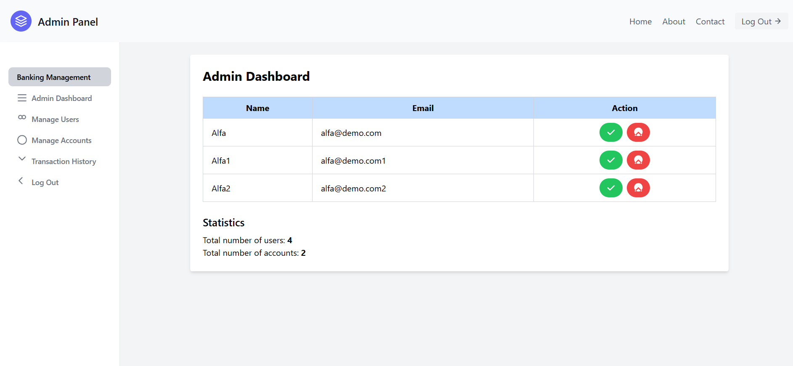
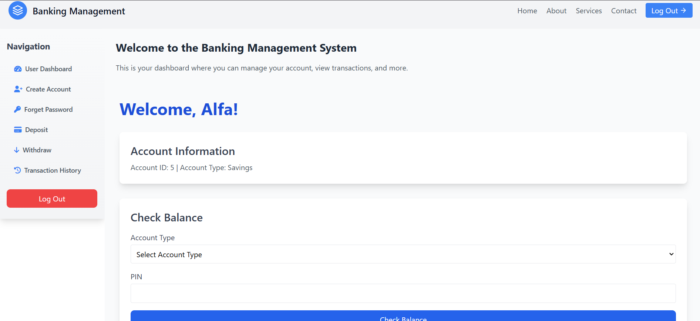

# 🏦 Banking Management System

## 📌 About the Project

This **Banking Management System** is built using **HTML, CSS, JavaScript, PHP, and PHPMailer**. It allows users to manage their bank accounts efficiently, featuring **signup, login, credit, debit, balance checks, transaction history, OTP-based password recovery**, and **admin controls** to oversee all accounts.

## 🛠️ Technologies Used

- **Frontend:** HTML, CSS, JavaScript
- **Backend:** PHP
- **Database:** MySQL (via XAMPP)
- **Email Services:** PHPMailer

## 🔐 Features

✅ **User Panel**

- Signup & Sign-in with validation
- Create bank account
- Credit & Debit money
- Check account balance
- View transaction history
- Forget PIN & recover via OTP (sent to email)

✅ **Admin Panel**

- Accept or reject new account creation requests
- Manage users and their accounts
- View & manage all transactions

## 📸 Screenshots

| SignUp Page                          | Admin Panel                                  | User Panel                                 |
| ------------------------------------ | -------------------------------------------- | ------------------------------------------ |
|  |  |  |

### 🔗 Direct Image Links

- **SignUp Page:** [View](https://raw.githubusercontent.com/alfahad5/Banking-Management-System/img/screenshot/SignUp.png)
- **Admin Panel:** [View](https://raw.githubusercontent.com/alfahad5/Banking-Management-System/img/screenshot/AdminPanel.png)
- **User Panel:** [View](https://raw.githubusercontent.com/alfahad5/Banking-Management-System/img/screenshot/UserPanel.png)
